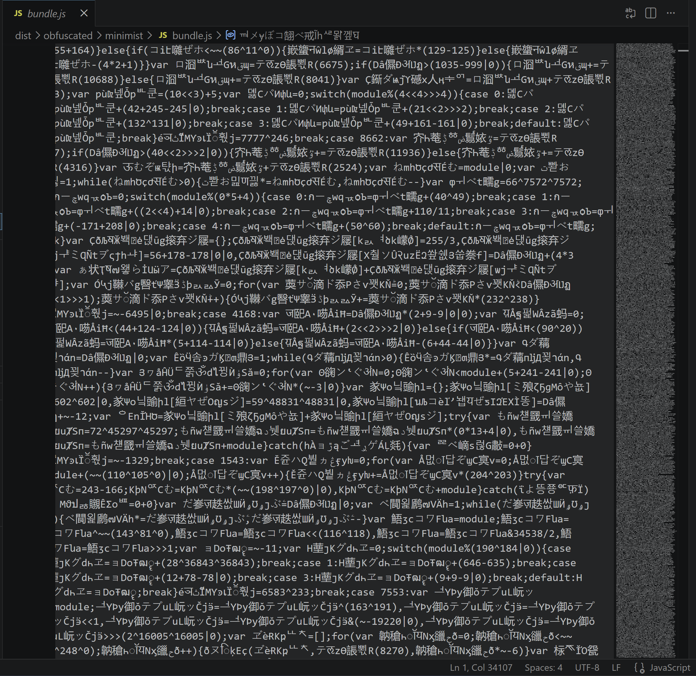

# egodeath

**This project does not achieve indistinguishability obfuscation. You should not be using this to product to protect secrets.  It exists to deter reverse engineering, not prevent it**



A JavaScript obfuscator designed to make code extremely difficult to read and analyze for both humans and LLMs. Written in TypeScript. Implements techniques from peer-reviewed cryptographic obfuscation research.

## Installation

```bash
npm install
npm run build
```

## CLI Usage

```bash
# Basic usage
node dist/index.js input.js > output.js

# With target token budget (default: 2,000,000)
node dist/index.js --target-tokens 500000 input.js > output.js

# Minimal obfuscation (small output)
node dist/index.js --target-tokens 10000 input.js > output.js

# Maximum bloat (10M tokens)
node dist/index.js --target-tokens 10000000 input.js > output.js

# Using environment variable
INPUT_FILE=input.js node dist/index.js > output.js

# Help
node dist/index.js --help
```

### Options

| Option | Default | Description |
|--------|---------|-------------|
| `--target-tokens <n>` | `2000000` | Target output size in tokens. Small inputs are bloated up to this limit. Large inputs produce less bloat to stay within budget. |
| `--help, -h` | | Show help message |

### npm scripts

```bash
npm run build              # Compile TypeScript to dist/
npm run start              # Run the obfuscator (reads input.js)
npm run test               # Run the test suite
npm run obfuscate-package  # Run compatibility tests against npm packages
```

## Programmatic API

```js
const { obfuscate } = require('./dist/obfuscator');

const code = 'function add(a, b) { return a + b; }';
const obfuscated = obfuscate(code);

// With options
const obfuscated = obfuscate(code, { targetTokens: 500000 });
```

## Transform Pipeline

The obfuscator applies 20 transforms across 4 phases. Each stage builds on the previous one.

### Phase 1: Security & Anti-Analysis Pre-transforms

| Order | Transform | File | Description |
|-------|-----------|------|-------------|
| 1 | **Anti-Debug Traps** | `transforms/antiDebug.ts` | Injects `eval("debugger")` statements and 10-20 `setInterval` loops with prime-number intervals (5s-600s) that repeatedly trigger debugger breakpoints. Each instance uses unique encoded strings. |
| 2 | **Punctured Program Tripwires** | `transforms/tripwires.ts` | Embeds hidden checks comparing parameter hashes against secret values. 5 hash patterns (bitwise fingerprint, modular arithmetic, charCodeAt, numeric hash, typeof+length). Triggers silent state corruption, busy loops, or throws on secret inputs. *[Paper 4]* |
| 3 | **LPN Noise Injection** | `transforms/noiseInjection.ts` | Adds and cancels random noise through split paths in arithmetic computations. 6 patterns: add/sub, XOR, mul/div, split dual-variable, computed hash-chain, bit-rotate. Intermediate values are meaningless without tracing full cancellation. *[Paper 7]* |

### Phase 2: Structural Pre-transforms

| Order | Transform | File | Description |
|-------|-----------|------|-------------|
| 4 | **Control Flow Flattening** | `transforms/controlFlowFlattening.ts` | Converts function bodies into `while(true) { switch((_s * P) % M) { ... } }` state machines with **modular arithmetic dispatch** — case values are encoded through `(stateId * multiplier) % modulus` using random prime parameters. *[Paper 3]* |
| 5 | **Opaque Predicates** | `transforms/opaquePredicates.ts` | Injects `if` conditions that always evaluate to true or false but are mathematically hard to prove (e.g., `(x*x+x)%2===0`). 15 predicate formulas across modular arithmetic, bitwise, and type-check categories. |
| 6 | **Proxy Functions** | `transforms/proxyFunctions.ts` | Routes all function calls through two dispatchers: `_fc(fn, ...args)` for simple calls, `_mc(obj, prop, ...args)` for method calls. Uses `Function.prototype.apply` captured in a local variable for resilience. |
| 7 | **Context Window Exhaustion** | `transforms/contextExhaustion.ts` | Wraps expressions in deeply nested ternaries with opaque conditions, void-expression chains, and conditional void padding. Forces LLMs to waste context window tokens on noise. |
| 8 | **Comma Expression Merging** | `transforms/commaExpressions.ts` | Collapses consecutive expression statements into single comma expressions: `a(); b(); return c()` becomes `return a(), b(), c()`. |

### Phase 3: Identifier Passes

| Order | Pass | File | Description |
|-------|------|------|-------------|
| 9 | **Pass 1: Catalog** | `passes/firstPass.ts` | Traverses the AST and catalogs every identifier, building a globals map that assigns each a random 6-16 character Unicode name drawn from 16 script ranges (CJK, Hangul, Greek, Cyrillic, Devanagari, Thai, Arabic, Katakana, etc.). |
| 10 | **Pass 2: Substitute** | `passes/secondPass.ts` | Replaces all identifier names with their obfuscated Unicode equivalents. Encodes `require()` arguments as `String.fromCharCode(...)`. Encodes static `import`/`export` sources as unicode-escaped string literals. Substitutes class `superClass` references, template literal expressions, destructuring patterns. |
| 11 | **Pass 3: Dummy Parameters** | `passes/thirdPass.ts` | Injects 0-15 random unused parameters into every function declaration and expression. Skips functions with rest parameters. Strips all comments. |

### Phase 4: Post-transforms

| Order | Transform | File | Description |
|-------|-----------|------|-------------|
| 12 | **Global Variable Encoding** | `transforms/globalVariableEncoding.ts` | Replaces references to globals (dynamically discovered from `globalThis` + `window` package) with `eval("Name<suffix>".replace(new RegExp("<suffix>$"), ""))`. Both strings flow through the string array. |
| 13 | **Property Key Encoding** | `transforms/propertyKeyEncoding.ts` | Converts dot access to computed access with per-scope registries. Cross-scope access works because all suffixes resolve to the same property name at runtime via `.replace()`. |
| 14 | **Number Encoding** | `transforms/numberEncoding.ts` | 11 encoding strategies: shift+add, XOR identity, complement, division, nested shifts, double-NOT, modular, etc. Each instance uniquely generated. Skips property keys and switch case values. |
| 15 | **Self-Integrity Verification** | `transforms/selfIntegrity.ts` | Injects 2-4 runtime checks: eval native-code verification, `Function.prototype.toString` integrity, timing anomaly detection, code structure validation. Anti-tamper responses: busy wait, throw, silent corruption. *[Paper 10]* |
| 16 | **String Array Extraction** | `transforms/stringArrayExtraction.ts` | Collects all strings into a single array with **chained XOR decryption** (key for entry N depends on decoded content of entry N-1) and **sparse position-dependent error patterns** (each character gets a different XOR key, with LPN-inspired sparse errors at select positions). *[Papers 2, 9]* |
| 17 | **Console Stubs** | `obfuscator.ts` | Dynamically discovers all `console` methods and sets each to a no-op function. |
| 18 | **Terser Minification** | `obfuscator.ts` | Strips whitespace/formatting via terser (`mangle: false`, `compress: false`). Falls back to regex-based stripping if terser can't parse the output. |

### Dead Code Injection

Dead code is injected at multiple points with two generation strategies:

| Strategy | Source | Description |
|----------|--------|-------------|
| **Template-based** | `transforms/deadCodeInjection.ts` | 9 template types: loop accumulation, array building, object manipulation, string concatenation, nested conditionals, try/catch, while countdown, switch computed, bitwise chains. Templates reference real scope variables. |
| **Mutation-based** | `transforms/deadCodeInjection.ts` | Clones REAL statements and mutates them: swaps operators within equivalence groups, perturbs constants, renames identifiers. Produces AST-structurally-identical dead code that is indistinguishable from real code by structure alone. *[Paper 3]* |

Dead code injection points:
- CFF dead switch cases (~30% extra per function, scaled by budget)
- Opaque predicate else branches
- Standalone dead blocks in non-CFF functions (budget-controlled)

## Research Paper References

Several transforms are inspired by peer-reviewed cryptographic obfuscation research:

| Paper | Authors | Technique Implemented |
|-------|---------|----------------------|
| **[Paper 1]** [On the (Im)possibility of Obfuscating Programs](https://www.wisdom.weizmann.ac.il/~oded/p_obfuscate.pdf) | Barak, Goldreich, Impagliazzo, Rudich, Sahai, Vadhan, Yang | Unobfuscatable function test cases — verification tool that tests if secrets survive obfuscation |
| **[Paper 2]** [Candidate iO and Functional Encryption for all Circuits](https://eprint.iacr.org/2013/451.pdf) | Garg, Gentry, Halevi, Raykova, Sahai, Waters | Chained string decryption — Kilian-style randomization where each entry's key depends on the previous decoded string |
| **[Paper 3]** [iO from the Multilinear Subgroup Elimination Assumption](https://eprint.iacr.org/2014/309.pdf) | Gentry, Lewko, Sahai, Waters | Mutation-based dead code (structurally identical to real code); modular arithmetic state transitions in CFF |
| **[Paper 4]** [How to Use iO: Deniable Encryption, and More](https://eprint.iacr.org/2013/454.pdf) | Sahai, Waters | Punctured program tripwires — hidden checks that trigger on secret inputs |
| **[Paper 7]** [iO from Well-Founded Assumptions](https://eprint.iacr.org/2020/1003.pdf) | Jain, Lin, Sahai | LPN-inspired noise injection in numeric computations |
| **[Paper 9]** [iO from Bilinear Maps and LPN Variants](https://eprint.iacr.org/2024/856.pdf) | Ragavan, Vafa, Vaikuntanathan | Sparse XOR encoding with position-dependent error patterns |
| **[Paper 10]** [iO of Null Quantum Circuits and Applications](https://arxiv.org/pdf/2106.06094.pdf) | Bartusek, Malavolta | Null circuit test for dead code quality verification; self-integrity verification (dual-mode) |

## Verification Tools

Two verification tools measure obfuscation quality, located in `src/verification/`:

### Null Circuit Test (`verification/nullCircuitTest.ts`)

Obfuscates a real function and a "null" function (same shape, does nothing), then compares 14 structural metrics to score how distinguishable they are. Higher similarity = better obfuscation.

```ts
import { runNullCircuitTest } from './verification/nullCircuitTest';
const result = runNullCircuitTest(realCode, paramCount, stmtCount, threshold, targetTokens);
console.log('Similarity:', result.similarity); // 0.0-1.0
```

### Unobfuscatable Function Tests (`verification/unobfuscatableTests.ts`)

7 test cases from Paper 1's impossibility proofs that attempt to extract secrets from obfuscated code:

```ts
import { runAllTests, printSummary } from './verification/unobfuscatableTests';
console.log(printSummary(runAllTests(10000)));
```

Tests: point function (password), magic numbers, canary strings, embedded keys, URLs, regex patterns, control flow signatures.

## Output Size Budget

The `--target-tokens` option controls output size via a bloat budget that scales dead code injection (the primary volume lever). Budget-gated transforms:

| Budget Ratio | Transforms Enabled |
|-------------|-------------------|
| > 3 | Anti-debug, tripwires, CFF, opaque predicates, comma merging |
| > 5 | Proxy functions, property key encoding, noise injection, self-integrity |
| > 8 | Context window exhaustion |
| > 10 | Global variable encoding |

Dead code multiplier scales from 1x (ratio 30) to 150x (ratio 1500+), controlling the number and size of dead switch cases and opaque predicate branches.

## Project Structure

```
src/
  index.ts              CLI entry point
  obfuscator.ts         Main pipeline orchestrator (20 transforms)
  options.ts            Budget system and options
  types.ts              AST type definitions
  random.ts             Random Unicode name generation (6-16 chars, 16 script ranges)
  ast.ts                AST node factory functions
  keywords.ts           Dynamic keyword discovery (globalThis + window package)
  globals.ts            Global state management (null-prototype maps)
  substitute.ts         Identifier substitution utilities
  declarations.d.ts     Module type declarations
  passes/
    firstPass.ts        Identifier cataloging
    secondPass.ts       Identifier substitution + string encoding
    thirdPass.ts        Dummy parameter injection
  transforms/
    antiDebug.ts        eval("debugger") traps + setInterval loops
    tripwires.ts        Punctured program secret-input checks [Paper 4]
    noiseInjection.ts   LPN-inspired arithmetic noise [Paper 7]
    controlFlowFlattening.ts  while/switch + modular arithmetic dispatch [Paper 3]
    opaquePredicates.ts       15 always-true/false math predicates
    proxyFunctions.ts         Call graph flattening dispatchers
    contextExhaustion.ts      Ternary/void noise for LLM context filling
    commaExpressions.ts       Statement merging via comma operator
    globalVariableEncoding.ts eval+replace for globals
    propertyKeyEncoding.ts    Computed property access with per-scope registries
    numberEncoding.ts         11 bitwise/arithmetic encoding strategies
    selfIntegrity.ts          Anti-tamper runtime checks [Paper 10]
    stringArrayExtraction.ts  Chained XOR + sparse position errors [Papers 2, 9]
    deadCodeInjection.ts      Template + mutation-based dead code [Paper 3]
  verification/
    nullCircuitTest.ts        Dead code quality scoring [Paper 10]
    unobfuscatableTests.ts    Secret extraction test cases [Paper 1]
  __tests__/                  300+ unit tests across 21 suites
tools/
  obfuscate-package.ts  Webpack-based npm package compatibility testing
tests/
  input*.js             Original test input files
```

## Testing

```bash
# Run all tests
npm test

# Run a specific test suite
npx jest controlFlowFlattening
npx jest tripwires
npx jest noiseInjection

# Test against npm packages (clones repos, webpack-bundles, obfuscates, runs tests)
npm run obfuscate-package                    # All 10 packages
npm run obfuscate-package -- minimist semver # Specific packages
```

## Compatibility Test Tool

The `tools/obfuscate-package.ts` tool tests the obfuscator against real npm packages:

1. Clones the package's git repository
2. Installs all dependencies (including devDependencies for testing)
3. Builds the package if it has a build script
4. Uses **webpack** to bundle the library's main entry point into a single CommonJS file
5. Runs the obfuscator on the bundled file
6. Replaces the library's main entry with the obfuscated bundle
7. Runs the library's own test suite against the obfuscated version

### Output locations

| Path | Contents |
|------|----------|
| `dist/obfuscated/<package>/bundle.js` | The obfuscated webpack bundle for each package |
| `dist/obfuscated/report.json` | Full JSON report with bundle sizes, obfuscation status, test output |

## License

MIT - Copyright 2026 Nicholas Starke
